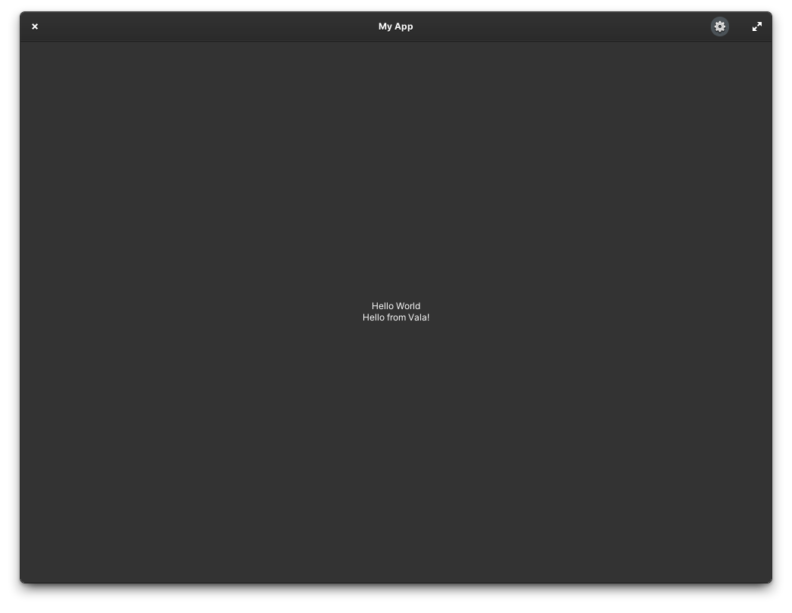
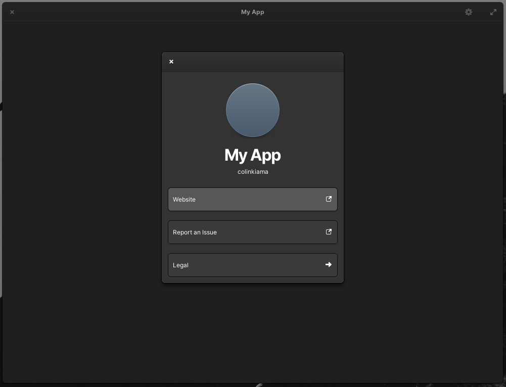

# {{APP_TITLE}}

{{APP_SUMMARY}}






## Build Instructions

### Flatpak (Recommended)

Either:

-   Use Visual Studio Code with [Flatpak extension](https://marketplace.visualstudio.com/items?itemName=bilelmoussaoui.flatpak-vscode)
-   Use [GNOME Builder](https://apps.gnome.org/en-GB/app/org.gnome.Builder/)
-   Flatpak integrations for of your preferred IDE/Code Editor
-   Or use the [flatpak and flatpak-builder](https://docs.flatpak.org/en/latest/first-build.htm) commands.

### Meson

#### Dependencies

-   glib-2.0
-   gobject-2.0
-   gee-0.8
-   gtk4
-   granite-7

#### Template Setup

Before you can build the project, you'll need to setup your project from the template.

Make the `setup` script exectuable if it isn't already:

(Assuming you're in the project root)

```sh
chmod +x ./setup
```

Then run the `./setup` script

(Assuming you're in the project root)

```sh
./setup
```

After running the setup script, you will be ready to build the project.

#### Build Commands

To setup build diectory:

```sh
meson build --prefix=/usr
```

To build:

(Assuming you're in the project root and have already setup the build directory)

```sh
cd build
ninja
```

To test:

(Assuming you're in the project root and have already built the app)

```sh
cd build
meson test
```

Or, to get more details about what's happening in the tests, add the `--verbose` flag:

```sh
cd build
meson test --verbose
```

To install:

(Assuming you're in project root)

```sh
cd build
sudo ninja install
```

## Publishing app to AppCenter

For information about publishing elementary OS apps to the AppCenter, visit the elementary OS developer documentation: https://docs.elementary.io/develop/appcenter/publishing-requirements